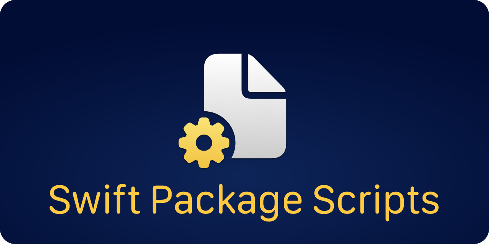

<p align="center">
    
</p>

<p align="center">
    
    
    
    <a href="https://twitter.com/danielsaidi"></a>
    <a href="https://mastodon.social/@danielsaidi"></a>
</p>


# About Swift Package Scripts

Swift Package Scripts let you easily build and test your Swift Package, generate DocC documentation and XCFrameworks, and create new versions.


## Scripts

The `scripts` filder contains the following scripts:

* `build.sh` - Run builds for all provided platforms.
* `chmod.sh` - Runs `chmod +x` on all scripts in the script folder.
* `docc.sh` - Build DocC documentation for all provided platforms.
* `framework.sh` - Build an XCFramework for all provided platforms.
* `git_default_branch.sh` - Get the default git branch name.
* `package_docc.sh` - Build DocC documentation for the main Swift package.
* `package_framework.sh` - Build an XCFramework for the main Swift package.
* `package_name.sh` - Get the name of the main Swift package.
* `package_version.sh` - Create a new version for the main Swift package.
* `sync_from.sh` - Sync the scripts folder from a Swift Package Scripts folder.
* `test.sh` - Run the project unit tests for all provided platforms.
* `version.sh` - Create a new version with validation and test steps.
* `version_bump.sh` - Bump the version number and push a new version tag.
* `version_number.sh` - Get the current git version number.
* `version_validate_git.sh` - Validate that a git repo is ready for release.
* `version_validate_target.sh` - Validate that a target is ready for release.

Note that you may have to run `chmod +x <SCRIPT>` to be able to run a script.


## Installation

Swift Package Scripts can be installed to your computer by cloning the repository:

```
git clone https://github.com/danielsaidi/SwiftPackageScripts.git
```

You can then navigate to the folder and sync the scripts to any older folder on your machine. 


## Sync scripts

The `sync_to.sh` script can be used to sync the entire `scripts` folder to another folder:

```shell
./sync_to.sh ../MyOtherProject
```

This will remove any already existing folder, and replace it with the latest version.

You can also run `scripts/sync_from.sh` from another folder, to update its scripts folder:

```shell
./scripst/sync_from.sh ../SwiftPackageScripts
```

This means that you can easily keep your projects in sync with your local copy of this project. 


## GitHub integrations

The `.github/workflows` folder contains `build` and `docc` runner files that are used to run tests and build DocC documentation with GitHub Actions on every push to the main branch.

These GitHub scripts are not part of the sync. You can manually copy them to your own project to integrate these scripts with GitHub Actions.


## Sample Package

This repository has a sample package that is used to test that everything works as expected.


## Documentation

For more information about these scripts, and how to set up project-specific scripts, see the online [here][Documentation].


## Support my work 

You can [sponsor me][Sponsors] on GitHub Sponsors or [reach out][Email] for paid support, to help support my [open-source projects][OpenSource].

Your support makes it possible for me to put more work into these projects and make them the best they can be.


## Contact

Feel free to reach out if you have questions or if you want to contribute in any way:

* Website: [danielsaidi.com][Website]
* Mastodon: [@danielsaidi@mastodon.social][Mastodon]
* Twitter: [@danielsaidi][Twitter]
* E-mail: [daniel.saidi@gmail.com][Email]


## License

SystemNotification is available under the MIT license. See the [LICENSE][License] file for more info.


[Email]: mailto:daniel.saidi@gmail.com
[Website]: https://www.danielsaidi.com
[GitHub]: https://www.github.com/danielsaidi
[Twitter]: https://www.twitter.com/danielsaidi
[Mastodon]: https://mastodon.social/@danielsaidi
[Sponsors]: https://github.com/sponsors/danielsaidi
[OpenSource]: https://www.danielsaidi.com/opensource

[Documentation]: https://danielsaidi.github.io/SwiftPackageScripts/
[License]: https://github.com/danielsaidi/SystemNotification/blob/master/LICENSE
