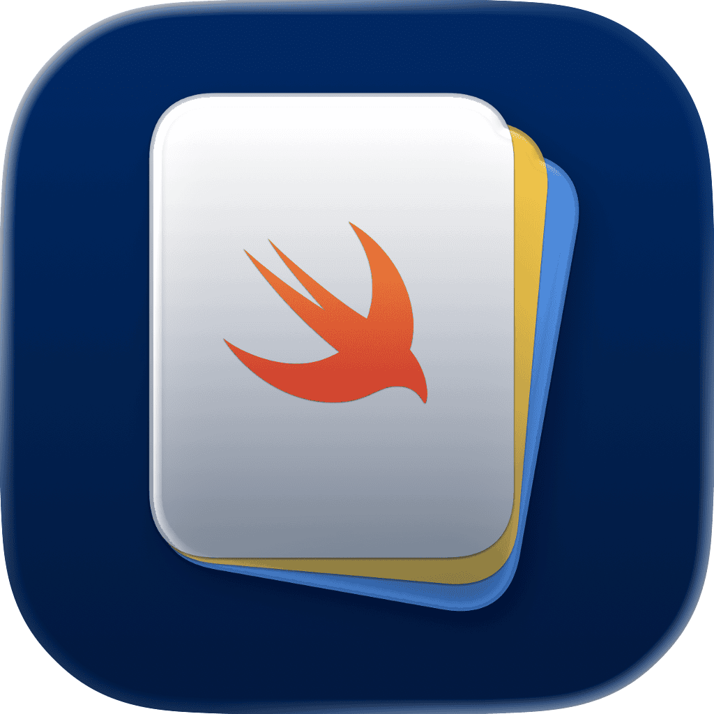

<p align="center">
    
</p>

<p align="center">
    
    
    <a href="https://danielsaidi.github.io/SwiftPackageScripts"></a>
    <a href="https://github.com/danielsaidi/SwiftPackageScripts/blob/master/LICENSE"></a>
</p>


# Swift Package Scripts

Swift Package Scripts has Terminal scripts that can be used to build and test your package, build DocC and deploy it to GitHub Pages, generate XCFramework binary artifacts, create new semantic versions, etc.

Swift Package Scripts also has a collection of GitHub Actions workflows that let you perform some operations from the GitHub Actions dashboard.


## Scripts

The `scripts` folder contains Swift Package-related scripts, that can all be customized with their own parameters:

* `build.sh` - Build a target for all or some platforms.
* `chmod-all.sh` - Runs `chmod +x` on all scripts in the script folder.
* `docc.sh` - Build DocC documentation for all or some platforms.
* `git_default_branch.sh` - Get the default git branch name.
* `package_name.sh` - Get the name of the main Swift package.
* `release.sh` - Make a release build with several validation steps.
* `sync_from.sh` - Sync `scripts` from a Swift Package Scripts folder.
* `test.sh` - Test a target on all or some platforms.
* `validate_git_branch.sh` - Validate the current branch.
* `validate_release.sh` - Validate the package for release.
* `version_bump.sh` - Bump the current version number and create a new tag.
* `version_number.sh` - Get the current version number from the latest tag.
* `xcframework.sh` - Build an XCFramework for all or some platforms.

Note that you have to run `chmod +x <SCRIPT>` to be able to run a script for the first time. You can use `chmod-all.sh` to do this for all `scripts`.


## GitHub Actions

The `.github` folder contains the following GitHub Actions workflows:

* `binary_artifacts.yml` - Build an XCFramework and dSYMs for all or some platforms.
* `build.yml` - Build the package for all or some platforms.
* `docc.yml` - Build DocC documentation and deploy it to GitHub Pages.
* `test.yml` - Test the package on all or some platforms.
* `version_bump.yml` - Bump the current version number and create a new tag.

Have a look at each file for workflow-specific information and if there is anything you need to do to make it work.


## Installation

Swift Package Scripts can be installed to your computer by cloning the repository:

```
git clone https://github.com/danielsaidi/SwiftPackageScripts.git
```

You can then navigate to the folder and sync the scripts to any older folder, using the `/sync_to.sh` script.

```shell
./sync_to.sh ../AnotherProjectFolder
```

This will remove any already existing folder and replace it with the latest version. After the first sync, you can use the `scripts/sync_from.sh` in that project folder to update its scripts.


## Sample Package

This repository has a sample package that is used to test that everything works as expected.


## Documentation

For more information about these scripts, and how to set up project-specific scripts, see the online [here][Documentation].


## Support My Work

You can [become a sponsor][Sponsors] to help me dedicate more time on my various [open-source tools][OpenSource]. Every contribution, no matter the size, makes a real difference in keeping these tools free and actively developed.


## Contact

Feel free to reach out if you have questions or if you want to contribute in any way:

* Website: [danielsaidi.com][Website]
* Mastodon: [@danielsaidi@mastodon.social][Mastodon]
* Twitter: [@danielsaidi][Twitter]
* E-mail: [daniel.saidi@gmail.com][Email]


## License

Swift Package Scripts is available under the MIT license. See the [LICENSE][License] file for more info.


[Email]: mailto:daniel.saidi@gmail.com
[Website]: https://www.danielsaidi.com
[GitHub]: https://www.github.com/danielsaidi
[Twitter]: https://www.twitter.com/danielsaidi
[Mastodon]: https://mastodon.social/@danielsaidi
[Sponsors]: https://github.com/sponsors/danielsaidi
[OpenSource]: https://www.danielsaidi.com/opensource

[Documentation]: https://danielsaidi.github.io/SwiftPackageScripts/
[License]: https://github.com/danielsaidi/SystemNotification/blob/master/LICENSE
